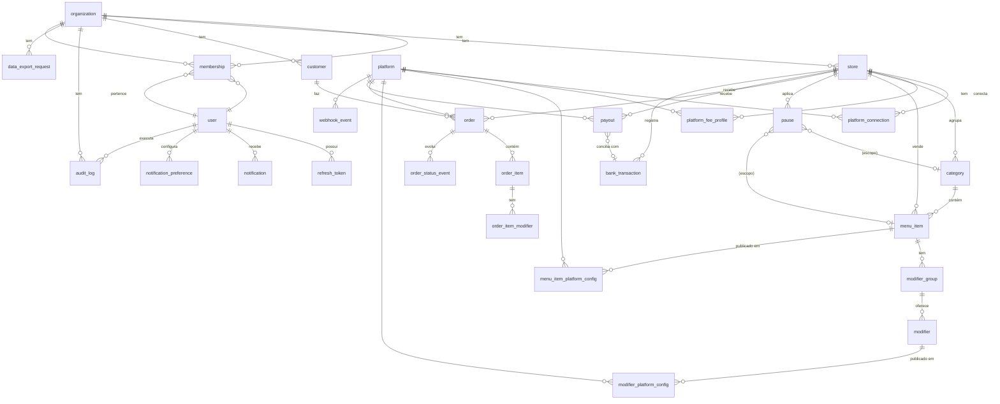

# DeliveryHub — Modelo de Dados (MVP)

> Versão: 0.1
> Banco: PostgreSQL 16
> ORM: Prisma
> Convenções: snake_case nas colunas, BIGINT em `*_cents`, UUID v7 nas PKs, todos os timestamps em UTC com timezone.

---

## 1. Princípios

1. **Multi-tenant por linha** — toda tabela de domínio tem `organization_id` (FK NOT NULL). RLS no app layer (Prisma middleware + interceptor NestJS) com testes; RLS nativo do Postgres entra na fase 2.
2. **Dinheiro em centavos** (BIGINT) para evitar erros de ponto flutuante.
3. **Sem soft-delete no MVP** — LGPD exige exclusão hard. Histórico via `audit_log`.
4. **Plataforma como dado, não enum de código** — adicionar Rappi/99Food é seed, não migration.
5. **Idempotência de webhooks** — `webhook_event(external_id, platform_id)` UNIQUE.
6. **Snapshot de nomes** em `order_item.name_snapshot` para manter histórico mesmo se o item for alterado/excluído depois.
7. **`external_id`** em qualquer tabela que sincronize com plataforma externa (Order, MenuItem, Category, Modifier).

---

## 2. ERD



> O diagrama omite tabelas auxiliares de auth e idempotência para não poluir; estão listadas abaixo.

---

## 3. Tabelas — descrição

### 3.1. Núcleo (tenancy e auth)

#### `organization`
Tenant raiz. Um restaurante (PME) ou rede.

| coluna | tipo | nota |
|---|---|---|
| id | UUID PK | |
| name | text | razão social ou nome fantasia |
| document | text | CNPJ (criptografado) |
| tax_regime | enum | `simples_nacional` \| `lucro_presumido` \| `lucro_real` (MVP: só simples) |
| created_at, updated_at | timestamptz | |

#### `user`
Identidade única (e-mail global). Pode pertencer a várias `organization` via `membership`.

| coluna | tipo | nota |
|---|---|---|
| id | UUID PK | |
| email | text UNIQUE | |
| password_hash | text | argon2id |
| name | text | |
| phone | text | nullable |
| two_factor_secret | text | nullable, criptografado (fase 2) |
| email_verified_at | timestamptz | nullable |
| created_at, updated_at | timestamptz | |

#### `membership`
Junction `user × organization` com papel.

| coluna | tipo | nota |
|---|---|---|
| id | UUID PK | |
| organization_id | UUID FK | |
| user_id | UUID FK | |
| role | enum | `owner` \| `manager` \| `staff` \| `financial` |
| store_scope | UUID[] | nullable; se preenchido, restringe acesso a essas lojas (fase 2 RBAC granular) |
| created_at | timestamptz | |
| UNIQUE | (organization_id, user_id) | |

#### `refresh_token`
Token rotacionado para JWT refresh.

| coluna | tipo | nota |
|---|---|---|
| id | UUID PK | |
| user_id | UUID FK | |
| token_hash | text UNIQUE | sha256 |
| user_agent, ip | text | |
| expires_at, revoked_at | timestamptz | |

#### `store`
Loja física/operacional dentro de uma organização.

| coluna | tipo | nota |
|---|---|---|
| id | UUID PK | |
| organization_id | UUID FK | |
| name | text | |
| address | jsonb | rua, número, cidade, UF, CEP |
| timezone | text | default `America/Sao_Paulo` |
| created_at, updated_at | timestamptz | |

---

### 3.2. Integrações com plataformas

#### `platform`
Tabela de referência (seed): iFood, Rappi, 99Food, Keeta, Uber Eats, AiQfome.

| coluna | tipo | nota |
|---|---|---|
| id | UUID PK | |
| code | text UNIQUE | `ifood`, `rappi`, ... |
| name | text | "iFood" |
| color_hex | text | para badge no Hub |
| active | bool | feature-flag de plataformas em rollout |

#### `platform_connection`
Loja conectada a uma plataforma.

| coluna | tipo | nota |
|---|---|---|
| id | UUID PK | |
| store_id | UUID FK | |
| platform_id | UUID FK | |
| status | enum | `pending` \| `active` \| `error` \| `revoked` |
| vault_ref | text | referência ao Vault/Secrets Manager para tokens — **nunca o token em si** |
| external_merchant_id | text | ID do restaurante na plataforma |
| last_sync_at, last_error_at | timestamptz | |
| last_error_message | text | nullable |
| UNIQUE | (store_id, platform_id) | |

#### `platform_fee_profile`
Taxas que a plataforma cobra **deste cliente específico**. Negociação por restaurante existe — então **precisa ser por `store × platform`**, não apenas global.

| coluna | tipo | nota |
|---|---|---|
| id | UUID PK | |
| store_id | UUID FK | |
| platform_id | UUID FK | |
| commission_pct | numeric(5,2) | ex.: 23.00 (23%) |
| payment_processing_pct | numeric(5,2) | ex.: 2.99 |
| flat_fee_cents | bigint | taxa fixa por pedido (raro) |
| effective_from | date | suporta histórico — calcular margem antiga com taxa antiga |
| UNIQUE | (store_id, platform_id, effective_from) | |

#### `webhook_event`
Idempotência de eventos recebidos das plataformas.

| coluna | tipo | nota |
|---|---|---|
| id | UUID PK | |
| platform_id | UUID FK | |
| external_id | text | ID do evento na plataforma |
| event_type | text | `order.placed`, `order.cancelled`, `merchant.status.changed`, ... |
| payload | jsonb | raw |
| received_at | timestamptz | |
| processed_at | timestamptz | nullable |
| error | text | nullable |
| UNIQUE | (platform_id, external_id) | |

---

### 3.3. Cardápio

#### `category`
| coluna | tipo | nota |
|---|---|---|
| id | UUID PK | |
| organization_id | UUID FK | |
| store_id | UUID FK | |
| name, description | text | |
| sort_order | int | |
| created_at, updated_at | timestamptz | |

#### `menu_item`
Item-mestre. Custo (CMV) fica aqui — é da loja, não da plataforma.

| coluna | tipo | nota |
|---|---|---|
| id | UUID PK | |
| organization_id | UUID FK | |
| store_id | UUID FK | |
| category_id | UUID FK | |
| name, description | text | |
| image_url | text | nullable |
| prep_time_minutes | int | nullable |
| cost_cents | bigint | **CMV** — base do cálculo de margem |
| allergens | text[] | "gluten", "lactose", ... |
| sort_order | int | |
| created_at, updated_at | timestamptz | |

#### `modifier_group`
"Escolha o pão", "Adicionais".

| coluna | tipo | nota |
|---|---|---|
| id | UUID PK | |
| organization_id | UUID FK | |
| menu_item_id | UUID FK | |
| name | text | |
| min_select, max_select | int | |
| required | bool | |
| sort_order | int | |

#### `modifier`
"Brioche", "Bacon extra".

| coluna | tipo | nota |
|---|---|---|
| id | UUID PK | |
| organization_id | UUID FK | |
| modifier_group_id | UUID FK | |
| name | text | |
| cost_delta_cents | bigint | quanto custa pra loja |
| sort_order | int | |

#### `menu_item_platform_config` ⭐
Configuração do item **por plataforma**. **É aqui que mora o preço e a margem.**

| coluna | tipo | nota |
|---|---|---|
| id | UUID PK | |
| organization_id | UUID FK | |
| menu_item_id | UUID FK | |
| platform_id | UUID FK | |
| external_id | text | ID do item na plataforma |
| external_category_id | text | nullable |
| selling_price_cents | bigint | **preço bruto** ao cliente nesta plataforma |
| is_published | bool | aparece no cardápio? |
| is_available | bool | "vende agora" (pausa por item) |
| last_sync_at, last_sync_error | timestamptz, text | |
| UNIQUE | (menu_item_id, platform_id) | |

**Margem líquida** é **calculada**, não armazenada (evita inconsistência). Fórmula:

```
gross_revenue   = selling_price_cents
commission      = gross_revenue * commission_pct/100
processing      = gross_revenue * payment_processing_pct/100
flat_fee        = flat_fee_cents
net_revenue     = gross_revenue - commission - processing - flat_fee
margin_cents    = net_revenue - cost_cents
margin_pct      = margin_cents / net_revenue
```

Exposta via view materializada `vw_menu_item_margin` (refresh em mudança de preço/taxa/CMV).

#### `modifier_platform_config`
Análogo a `menu_item_platform_config`, para modificadores.

---

### 3.4. Pausas (diferencial #2 ⭐)

#### `pause`
Pausa é um intervalo, não um flag, para permitir agendamento e histórico.

| coluna | tipo | nota |
|---|---|---|
| id | UUID PK | |
| organization_id | UUID FK | |
| store_id | UUID FK | |
| scope | enum | `store` \| `category` \| `item` |
| category_id | UUID FK | nullable, obrigatório se scope=category |
| menu_item_id | UUID FK | nullable, obrigatório se scope=item |
| platform_ids | UUID[] | nullable = todas as plataformas; ou subset = pausa seletiva |
| starts_at, ends_at | timestamptz | `ends_at` nullable = pausa indefinida |
| reason | enum | `kitchen_overloaded` \| `end_of_shift` \| `out_of_stock` \| `scheduled` \| `other` |
| reason_note | text | nullable |
| created_by | UUID FK user | |
| cancelled_at, cancelled_by | timestamptz, UUID | nullable (pausa reaberta antes do `ends_at`) |
| created_at | timestamptz | |

**Pausas ativas agora** = view `vw_active_pauses` (now() between starts_at and ends_at, not cancelled).

---

### 3.5. Pedidos

#### `customer`
Cliente unificado por telefone/CPF dentro da organização (não global, por privacidade).

| coluna | tipo | nota |
|---|---|---|
| id | UUID PK | |
| organization_id | UUID FK | |
| phone | text | nullable, criptografado |
| document | text | CPF, nullable, criptografado |
| name | text | |
| first_seen_at, last_seen_at | timestamptz | |
| UNIQUE | (organization_id, phone) where phone is not null | |
| UNIQUE | (organization_id, document) where document is not null | |

#### `order`
| coluna | tipo | nota |
|---|---|---|
| id | UUID PK | |
| organization_id | UUID FK | |
| store_id | UUID FK | |
| platform_id | UUID FK | |
| external_id | text | ID do pedido na plataforma |
| customer_id | UUID FK | nullable (cliente anônimo) |
| status | enum | `placed` \| `accepted` \| `preparing` \| `ready` \| `dispatched` \| `delivered` \| `cancelled` |
| subtotal_cents, total_cents | bigint | |
| platform_fee_cents | bigint | comissão calculada na hora do pedido (snapshot) |
| processing_fee_cents | bigint | |
| flat_fee_cents | bigint | |
| net_cents | bigint | `total - all fees` |
| placed_at | timestamptz | |
| accepted_at, dispatched_at, delivered_at | timestamptz | nullable |
| notes | text | observações do cliente |
| UNIQUE | (platform_id, external_id) | |

#### `order_item`
| coluna | tipo | nota |
|---|---|---|
| id | UUID PK | |
| order_id | UUID FK | |
| menu_item_id | UUID FK | nullable (caso o item não exista mais ou venha de plataforma sem matching) |
| external_id | text | ID do item na plataforma |
| name_snapshot | text | nome no momento do pedido — sobrevive a alterações posteriores |
| qty | int | |
| unit_price_cents, total_cents | bigint | |
| notes | text | |

#### `order_item_modifier`
| coluna | tipo | nota |
|---|---|---|
| id | UUID PK | |
| order_item_id | UUID FK | |
| modifier_id | UUID FK | nullable |
| external_id | text | |
| name_snapshot | text | |
| qty | int | |
| unit_price_cents | bigint | |

#### `order_status_event`
Linha-do-tempo do pedido.

| coluna | tipo | nota |
|---|---|---|
| id | UUID PK | |
| order_id | UUID FK | |
| status | enum | mesmo do `order.status` |
| source | enum | `platform` \| `user` \| `system` |
| actor_user_id | UUID FK | nullable |
| at | timestamptz | |
| metadata | jsonb | nullable |

---

### 3.6. Financeiro

#### `payout`
Repasse esperado/recebido de uma plataforma.

| coluna | tipo | nota |
|---|---|---|
| id | UUID PK | |
| organization_id | UUID FK | |
| store_id | UUID FK | |
| platform_id | UUID FK | |
| reference_period_start, reference_period_end | date | |
| expected_amount_cents | bigint | |
| expected_pay_date | date | |
| received_amount_cents | bigint | nullable |
| received_at | timestamptz | nullable |
| bank_transaction_id | UUID FK | nullable |
| status | enum | `pending` \| `partial` \| `reconciled` \| `mismatch` |
| notes | text | |

#### `bank_transaction`
Lançamento bancário importado (CSV/OFX). MVP: upload manual de CSV; fase 2: integração via Open Finance.

| coluna | tipo | nota |
|---|---|---|
| id | UUID PK | |
| organization_id | UUID FK | |
| store_id | UUID FK | |
| date | date | |
| amount_cents | bigint | |
| description | text | |
| raw | jsonb | |
| imported_at | timestamptz | |

---

### 3.7. Notificações

#### `notification`
| coluna | tipo | nota |
|---|---|---|
| id | UUID PK | |
| organization_id | UUID FK | |
| user_id | UUID FK | |
| kind | enum | `new_order` \| `platform_disconnected` \| `payout_mismatch` \| `daily_goal` \| `system` |
| title, body | text | |
| link_url | text | nullable |
| read_at | timestamptz | nullable |
| created_at | timestamptz | |

#### `notification_preference`
| coluna | tipo | nota |
|---|---|---|
| id | UUID PK | |
| user_id | UUID FK | |
| kind | text | mesmo enum acima |
| channel_in_app, channel_email | bool | |
| (channel_push: fase 2) | | |
| UNIQUE | (user_id, kind) | |

---

### 3.8. Auditoria e LGPD

#### `audit_log`
| coluna | tipo | nota |
|---|---|---|
| id | UUID PK | |
| organization_id | UUID FK | |
| user_id | UUID FK | nullable (ação automática) |
| entity | text | nome da tabela |
| entity_id | text | UUID ou composto |
| action | enum | `create` \| `update` \| `delete` \| `login` \| `pause` \| `resume` \| `price_change` \| `export` |
| diff | jsonb | before/after de campos sensíveis |
| ip, user_agent | text | nullable |
| at | timestamptz | |

#### `consent_log`
| coluna | tipo | nota |
|---|---|---|
| id | UUID PK | |
| subject_kind | enum | `user` \| `customer` |
| subject_id | UUID | |
| kind | enum | `terms` \| `privacy` \| `marketing` |
| version | text | |
| accepted | bool | |
| at | timestamptz | |
| ip, user_agent | text | |

#### `data_export_request`
| coluna | tipo | nota |
|---|---|---|
| id | UUID PK | |
| organization_id | UUID FK | |
| requester_kind | enum | `user` \| `customer` |
| requester_id | UUID | |
| operation | enum | `export` \| `delete` |
| status | enum | `requested` \| `processing` \| `done` \| `failed` |
| file_url | text | nullable (caminho em storage com link assinado e expiração) |
| requested_at, completed_at | timestamptz | |

---

## 4. Índices críticos

- `order(platform_id, external_id)` UNIQUE
- `order(organization_id, store_id, placed_at DESC)` — listagem hub
- `order_status_event(order_id, at DESC)` — timeline
- `pause(organization_id, store_id, starts_at, ends_at)` — pausas ativas
- `webhook_event(platform_id, external_id)` UNIQUE
- `menu_item_platform_config(menu_item_id, platform_id)` UNIQUE
- `customer(organization_id, phone)` UNIQUE WHERE phone IS NOT NULL
- `audit_log(organization_id, entity, entity_id, at DESC)`

---

## 5. Decisões e justificativas

1. **PK UUID v7** — ordenável por tempo (melhor index locality que v4), sem leak de cardinalidade que IDs incrementais teriam.
2. **Multi-tenant in-app vs RLS Postgres** — RLS é mais seguro mas mais lento e complexo. No MVP, `organization_id` em todo método de service + Prisma middleware que injeta filtro + testes que falham se algum service esquecer. Migração para RLS é refactor incremental.
3. **Margem como view, não coluna** — qualquer mudança em CMV ou taxa precisaria UPDATE em N linhas; view materializada centraliza.
4. **`name_snapshot` em order_item** — pedidos antigos precisam continuar legíveis mesmo após alterações.
5. **Sem soft delete** — LGPD exige hard delete; `audit_log` preserva o que existiu.
6. **Criptografia de PII** — `customer.phone`, `customer.document`, `organization.document` usando `pgcrypto` simétrica com chave no Vault. Busca por hash separado (`phone_hash`) — adiar a indexação cifrada (CipherSweet) para fase 2.
7. **Plataforma como tabela, não enum** — permite adicionar Rappi/99Food via seed sem migration.
8. **Pausa como intervalo** — `starts_at`/`ends_at` cobre pausa manual, programada e agendada com um único conceito.

---

## 6. O que **não** está no MVP

- Estoque/ficha técnica (`ingredient`, `recipe`, `stock_movement`) — fase 2
- KDS (`kds_station`, `ticket_routing`) — fase 2
- CRM avançado (segmentação, RFM) — fase 2
- Promoções/cupons (`promotion`, `coupon`) — fase 2
- Versionamento explícito de cardápio (`menu_version`) — adia, audit_log basta para MVP
- Multi-loja granular (RBAC `store_scope` está no schema mas UI/regra só na fase 2)
