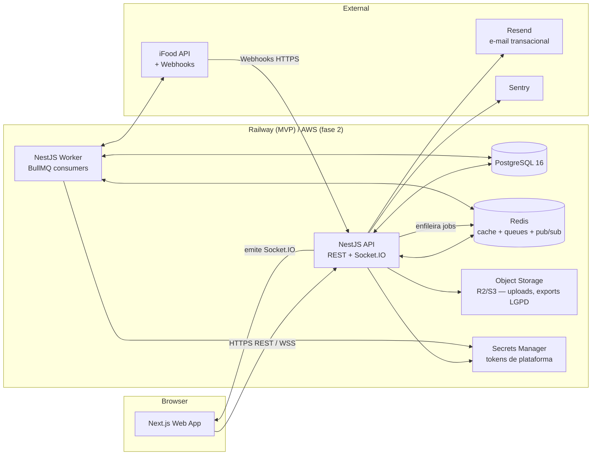
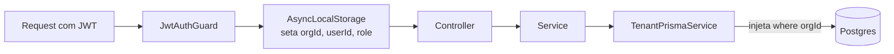
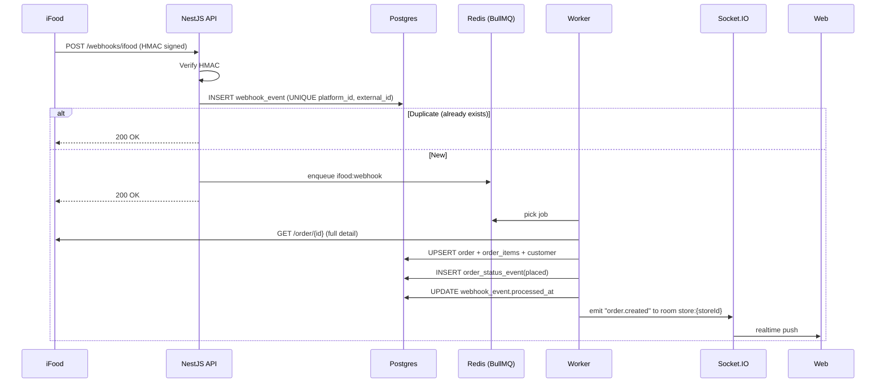
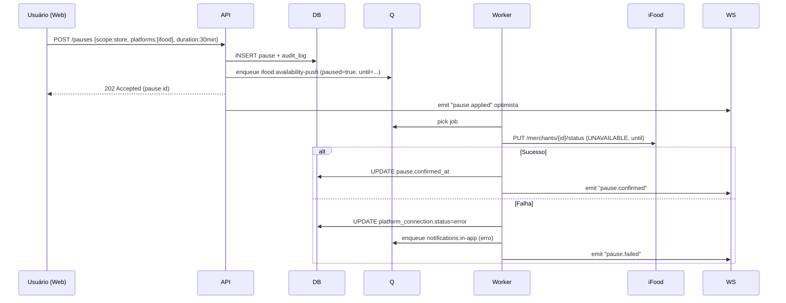
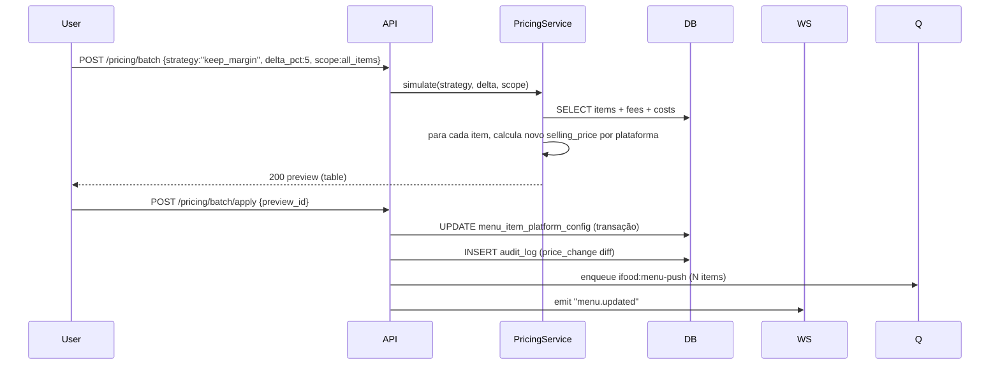
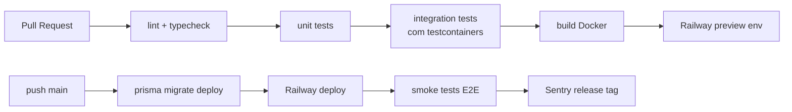

# DeliveryHub — Arquitetura de Alto Nível (MVP)

> Versão: 0.1
> Estilo: Modular Monolith (não microsserviços)
> Justificativa: solo dev, escala-alvo do MVP até centenas de restaurantes, ciclo de iteração rápido. Modularização correta agora permite extrair serviços depois sem refactor doloroso.

---

## 1. Visão de sistema



**No MVP, `API` e `WORKER` são dois processos rodando a mesma imagem Docker com flag de modo** (`MODE=api` ou `MODE=worker`). Isso simplifica deploy e permite escalar workers independente da API quando necessário.

---

## 2. Monorepo

```
deliveryhub/
├── apps/
│   ├── web/          # Next.js 15 (App Router) + Tailwind + shadcn/ui
│   └── api/          # NestJS — REST, Socket.IO, BullMQ workers
├── packages/
│   ├── db/           # Prisma schema, migrations, seed, client gerado
│   ├── shared/       # zod schemas, tipos, constantes (DTOs compartilhados FE↔BE)
│   ├── ifood/        # Adapter iFood (cliente HTTP + tipos + mock)
│   └── config/       # eslint, tsconfig, prettier compartilhados
├── docs/             # PRD, modelo de dados, arquitetura, decisões
├── infra/
│   ├── docker/       # Dockerfile multi-stage
│   └── railway/      # railway.json
├── .github/
│   └── workflows/    # CI/CD
├── turbo.json
├── pnpm-workspace.yaml
└── package.json
```

**Por que monorepo:** tipos compartilhados entre Next.js e NestJS via `packages/shared` (DTOs em Zod geram TS estático em ambos os lados). Mudou um schema, ambos quebram no `tsc` antes de quebrar em produção.

---

## 3. Estrutura interna da API (NestJS — modular monolith)

```
apps/api/src/
├── main.ts                       # bootstrap (modo: api ou worker)
├── app.module.ts
├── modules/
│   ├── auth/                     # JWT, refresh, RBAC guards
│   ├── organizations/
│   ├── users/
│   ├── stores/
│   ├── platforms/                # tabela de referência + admin
│   ├── integrations/
│   │   ├── platform-adapter.interface.ts
│   │   ├── ifood/                # usa @deliveryhub/ifood
│   │   └── adapter.registry.ts   # mapeia code → adapter
│   ├── menu/                     # categories, items, modifiers, sync
│   ├── pricing/                  # cálculo de margem, simulador what-if, batch
│   ├── orders/                   # CRUD + state machine + Socket.IO gateway
│   ├── pauses/                   # pausa total/seletiva/programada
│   ├── financial/                # payouts, conciliação CSV
│   ├── notifications/            # in-app + e-mail
│   ├── webhooks/                 # endpoints públicos, HMAC verify, enqueue
│   ├── audit/                    # AuditLogService (interceptor)
│   └── compliance/               # LGPD: consent, export, delete
├── common/
│   ├── tenant/                   # AsyncLocalStorage, TenantPrismaService
│   ├── crypto/                   # PII encrypt/decrypt
│   ├── vault/                    # Secrets abstraction
│   ├── filters/                  # exception → ProblemDetails (RFC 7807)
│   ├── interceptors/             # audit, logging
│   └── decorators/               # @Roles, @Tenant, @Public
├── workers/                      # BullMQ consumers (ativados em MODE=worker)
│   ├── ifood-webhook.processor.ts
│   ├── ifood-menu-push.processor.ts
│   ├── ifood-pause-push.processor.ts
│   ├── notifications.processor.ts
│   └── reconciliation.processor.ts
└── config/
    └── env.ts                    # zod-validated env vars
```

### Princípios

- **Domínio orientado a módulos NestJS**, cada um com seus próprios `controller`, `service`, `dto`, `repository`. Comunicação cross-module **só via service injetado** (nunca acessar repositório de outro módulo).
- **DTOs validados com Zod** (via `nestjs-zod`), compartilhados via `packages/shared`.
- **Repository pattern fino** — `PrismaService` em vez de classes Repository custom. Apenas envolve queries complexas em métodos do service.
- **State machines explícitas** para `Order` e `Pause` (biblioteca: `xstate` fica overkill no MVP; uso uma função pura `transition(currentStatus, event) → newStatus | error`).

---

## 4. Multi-tenant — enforcement de `organization_id`



- **`TenantPrismaService`** estende o Prisma Client com middleware que injeta `where: { organizationId: getCurrentOrgId() }` em todo `find`/`update`/`delete`.
- Tabelas globais (`platform`, `user` no nível raw) marcam-se com `@tenantExempt` para escapar.
- **Teste obrigatório por endpoint**: assertion `expect(spy).toHaveBeenCalledWithFilter({organizationId: 'x'})`. Sem isso, a feature não passa no DoD.
- **Fase 2:** migrar para RLS nativo do Postgres como camada extra. O código atual continua funcionando.

---

## 5. Pattern de Adapter por plataforma

```typescript
// packages/shared/src/platform-adapter.interface.ts
export interface PlatformAdapter {
  readonly code: 'ifood' | 'rappi' | '99food' | 'keeta' | 'ubereats' | 'aiqfome';

  connect(authCode: string, redirectUri: string): Promise<ConnectResult>;
  refreshAuth(connectionId: string): Promise<void>;
  fetchMenu(connectionId: string): Promise<RemoteMenu>;
  pushMenuItem(connectionId: string, item: MenuItemPush): Promise<void>;
  pushItemAvailability(connectionId: string, externalId: string, available: boolean): Promise<void>;
  pushStorePause(connectionId: string, paused: boolean, until?: Date, reason?: string): Promise<void>;
  acceptOrder(connectionId: string, externalOrderId: string): Promise<void>;
  rejectOrder(connectionId: string, externalOrderId: string, reason: string): Promise<void>;
  dispatchOrder(connectionId: string, externalOrderId: string): Promise<void>;
  verifyWebhookSignature(headers: Record<string, string>, rawBody: Buffer): boolean;
  parseWebhook(payload: unknown): PlatformWebhookEvent;
}
```

- **MVP:** `IFoodAdapter` (real) + `MockAdapter` (dev/test).
- **Adicionar Rappi** = nova classe + seed em `platform` + UI list, **sem mexer em nenhum módulo de domínio**.
- `AdapterRegistry` resolve por `platform.code` → adapter via DI.

---

## 6. Filas (BullMQ + Redis)

| Fila | Trigger | Job | Retry policy |
|---|---|---|---|
| `ifood:webhook` | webhook recebido | Persiste evento idempotente, aciona handler | 5x exp backoff (~30s, 1m, 5m, 30m, 2h) |
| `ifood:menu-push` | usuário salva item ou batch | Push de criar/atualizar item no iFood | 3x backoff |
| `ifood:availability-push` | pause/resume item ou loja | Toggle availability/store status no iFood | 3x backoff |
| `notifications:email` | trigger interno | Envia via Resend | 5x backoff |
| `notifications:in-app` | trigger interno | Persiste + emit Socket.IO | 1x (rápido) |
| `financial:reconcile` | upload CSV de extrato | Algoritmo de matching | 1x (idempotente por upload) |
| `audit:write` | interceptor → fila | Insere `audit_log` async | 3x backoff |
| `compliance:export` | usuário pede export LGPD | Gera ZIP, upload Storage, e-mail link | 2x |
| `compliance:delete` | usuário/cliente pede delete LGPD | Anonimiza + delete cascata | 1x (manual review se falhar) |

**Dead-letter:** todas as filas têm DLQ. Quando excedem tentativas, vai para `:failed` que tem alerta no Sentry e endpoint admin para reprocessar.

---

## 7. Fluxos críticos

### 7.1. Pedido novo (webhook iFood → Hub em tempo real)



### 7.2. Pausa total seletiva



### 7.3. Recálculo de margem em batch ⭐



---

## 8. Segurança

| Camada | Mecanismo |
|---|---|
| Transporte | TLS 1.3 (Railway managed) |
| Autenticação | JWT access (15min) + refresh token rotativo (30 dias, hash sha256 no DB) |
| Senha | Argon2id (`@node-rs/argon2`) |
| 2FA | TOTP — fase 2 (campo já no schema) |
| Autorização | RBAC com decorator `@Roles(...)` + guard; tenant isolation por `AsyncLocalStorage` |
| Secrets externos | Abstração `VaultService`. **MVP:** Railway env + AES-256-GCM com `MASTER_KEY` para tokens de plataforma armazenados em `platform_connection.vault_ref` apontando para linha de `vault_secret` cifrada. **Fase 2:** AWS Secrets Manager / HashiCorp Vault. |
| PII em repouso | `pgcrypto` simétrica em `customer.phone`, `customer.document`, `organization.document` |
| Webhooks | Verificação HMAC obrigatória; rejeição com 401 antes de qualquer processamento |
| Rate limiting | `@nestjs/throttler` — login (5/min), refresh (10/min), webhooks (1000/min com burst), API geral (300/min/IP) |
| CORS | Whitelist explícita por domínio |
| Headers | `helmet` + CSP estrito no Next.js |
| Auditoria | Interceptor automático em mutations de `pricing`, `pauses`, `compliance`, `auth` |

---

## 9. Observabilidade

- **Logs:** `pino` JSON estruturado, request-id via correlation header, redaction automática de PII e tokens. Stdout → Railway log drain → Better Stack (fase 2).
- **Erros:** Sentry com source maps. Tag de `orgId`, `userId`, `platform`.
- **Health checks:** `/healthz` (liveness — só responde 200), `/readyz` (DB + Redis ping).
- **Métricas:** counter de webhooks recebidos/processados/falhados, latência p50/p95, jobs em fila, jobs em DLQ. Exposto em `/metrics` (Prometheus format) — coleta no fase 2.
- **Dashboards de domínio** (na própria app, não Grafana): pedidos por minuto, estado das conexões de plataforma, profundidade das filas.

---

## 10. Testes

| Tipo | Stack | Cobertura mínima |
|---|---|---|
| Unit | Vitest | `pricing` (cálculos de margem), state machines, `pause-resolution`, `crypto`, `tenant-filter` — 90% |
| Integration | Vitest + Testcontainers (Postgres + Redis) + `@nestjs/testing` | Cada module-service tocando DB — 80% dos serviços críticos |
| Contract | Vitest + fixtures JSON | `IFoodAdapter` contra payloads de exemplo do sandbox iFood |
| E2E | Playwright | Login → conectar iFood (mock) → receber pedido (mock webhook) → aceitar → ver no histórico; Pausar loja; Alterar preço em batch |
| Load | k6 (fase 2) | Webhook iFood — 1000 req/s sustained |

**Sem testes, sem merge.** GitHub Actions bloqueia PR.

---

## 11. CI/CD



- **Migrations não-bloqueantes**: regra de duas-fases para schema changes destrutivas (expand → migrate → contract).
- **Rollback:** revert do commit + `prisma migrate resolve` se schema mudou.

---

## 12. Ambientes

| Ambiente | Onde | Banco | Tokens iFood |
|---|---|---|---|
| Local dev | docker-compose (Postgres + Redis) | Banco local | Sandbox iFood ou MockAdapter |
| Staging | Railway preview / projeto separado | Postgres pequena | Sandbox iFood |
| Production | Railway prod | Postgres com backups diários (PITR) | iFood real |

---

## 13. ADRs (Architectural Decision Records)

Vou manter `docs/adr/NNNN-titulo.md` com decisões importantes. Iniciais propostas:

- ADR-0001 — Modular monolith vs microsserviços
- ADR-0002 — Multi-tenant no app layer (não RLS) no MVP
- ADR-0003 — Margem como view materializada
- ADR-0004 — Adapter pattern por plataforma
- ADR-0005 — Idempotência de webhooks via UNIQUE constraint
- ADR-0006 — Money em BIGINT cents

---

## 14. Roadmap arquitetural pós-MVP

- **Q1:** Extrair `worker` em service Railway separado quando volumetria de fila justificar (>5 jobs/s sustained).
- **Q2:** Adotar RLS Postgres como camada extra de tenant isolation.
- **Q3:** Read replicas para relatórios pesados; talvez `ClickHouse` para BI.
- **Q4:** Extrair `integrations` em microsserviço se número de plataformas crescer e ciclo de deploy delas diferir do core.
